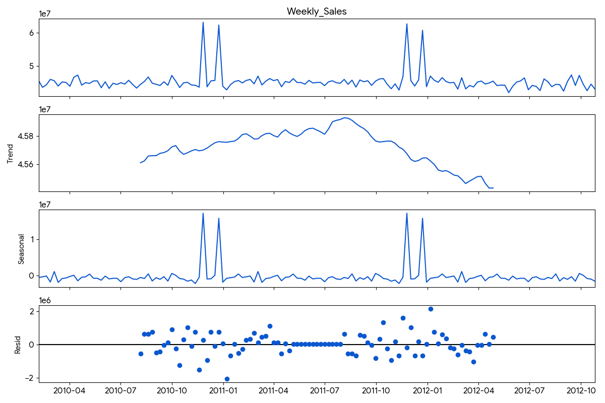
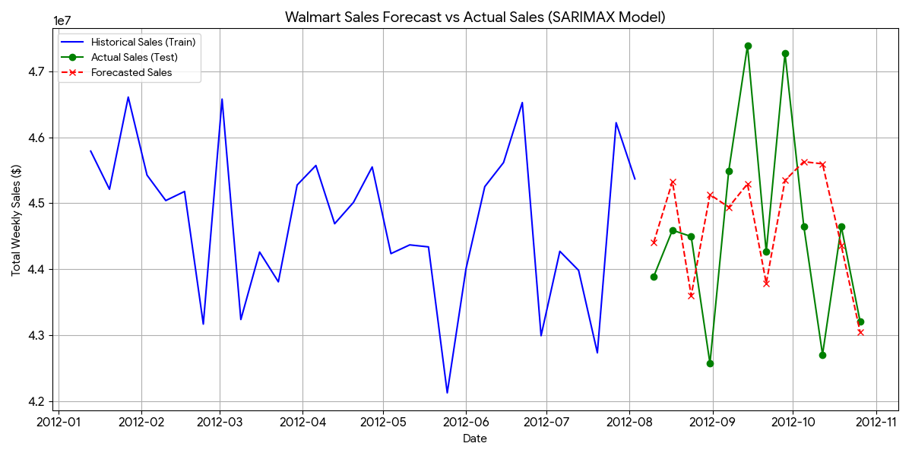

# Sales Forecasting Analytics 📈🛒

An end-to-end Data Analytics and Time Series Forecasting project that analyzes historical retail sales data (Walmart Dataset) to predict future sales trends and decompose seasonal patterns.

---

## 🖼️ Analysis & Forecast Visualizations

### 1. Sales Forecast Plot (Actual vs Predicted)


---

### 2. Time Series Seasonal Decomposition


---

## 🚀 Overview

Accurate sales forecasting is critical for supply chain management, inventory optimization, and financial planning in retail. This project processes historical weekly sales records, applies Time Series modeling and Machine Learning techniques, and visualizes seasonal trends, underlying growth patterns, and residual variations.

### Key Highlights:
* **Time Series Analysis:** Identifies underlying trend, seasonality, and cyclic behaviors in retail sales.
* **Sales Prediction Pipeline:** Implements Machine Learning and Time Series models to forecast future sales performance.
* **Exploratory Data Analysis (EDA):** Deep dives into holiday effects, store-level sales variations, and promo impact.
* **Automated Plotting:** Generates clear visualizations for model predictions vs actual historical data.

---

## 🛠️ Tech Stack & Libraries

* **Language:** Python 3.8+
* **Data Manipulation:** Pandas, NumPy
* **Time Series & ML:** Statsmodels, Scikit-learn
* **Data Visualization:** Matplotlib, Seaborn

---

## 📁 Project Structure

```text
Sales Forecasting Analytics/
│
├── sales_forecasting.py           # Main Python script for EDA & Forecasting
├── Walmart.csv                    # Historical Walmart Sales Dataset
├── sales_forecast_plot.png.png    # Visualization: Sales Prediction vs Actual
├── seasonal_decomposition.png.png # Visualization: Trend & Seasonality Decomposition
├── requirements.txt               # List of required Python dependencies
└── README.md                      # Project documentation
